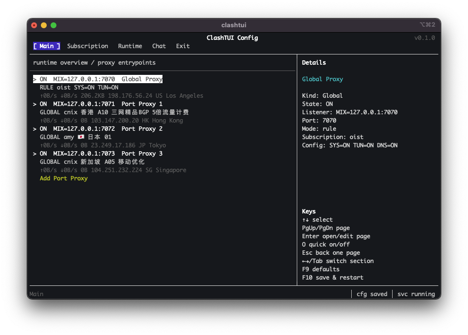

# clashtui

<p align="right">
English | <a href="./README.zh-CN.md">中文</a>
</p>

`clashtui` is a terminal UI and background controller for
[MetaCubeX/mihomo](https://github.com/MetaCubeX/mihomo). It is not a proxy core
itself. It manages mihomo profiles, local listeners, runtime state, system
proxy, DNS, and optional TUN from one compact TUI.

<p align="center">
  
</p>

## What It Does

- Runs a Global Proxy listener, defaulting to `127.0.0.1:7070`.
- Adds multiple Port Proxy listeners, for example `127.0.0.1:7071`,
  `127.0.0.1:7072`, and more.
- Lets each Port Proxy choose its own subscription, mode, and proxy target.
- Uses one mihomo runtime by default: Global Proxy, DNS, TUN, and Port Proxy
  listeners are generated into one mihomo config.
- Supports subscriptions, proxy groups, node selection, traffic usage, expiry,
  and local profile cache.
- Supports system proxy, mihomo DNS, and optional TUN mode.
- Provides a privileged service mode for TUN on macOS/Linux, while ordinary
  Port Proxy usage still works without the service.
- Can use a custom mihomo binary or download a managed MetaCubeX/mihomo release
  into the clashtui config directory.
- Includes a native LLM Chat assistant for explaining runtime behavior,
  inspecting logs/config, and proposing safe draft config patches.
- Keeps LLM provider presets in `llm-providers.yaml`; API keys and custom model
  ids stay local, while bundled provider updates are merged only when the user
  runs the Runtime action.

## Quick Start

Build:

```bash
cargo build --release
```

Open the setup UI:

```bash
target/release/clashtui config
```

The TUI defaults to English. Use `--language zh-CN` for Simplified Chinese UI
and assistant replies while keeping technical terms such as LLM, Runtime, DNS,
TUN, Provider, Model, Base URL, Port Proxy, and mihomo unchanged:

```bash
target/release/clashtui --language zh-CN config
```

Start the background runtime:

```bash
target/release/clashtui start
```

Check status:

```bash
target/release/clashtui status
```

Stop or restart:

```bash
target/release/clashtui stop
target/release/clashtui restart
```

During development you can use:

```bash
cargo run -- config
cargo run -- start
cargo run -- status
```

## Development

Requirements:

- Rust toolchain with Cargo.
- macOS or Linux for full service/TUN development. Normal config, status, and
  user-mode runtime flows can still be developed without installing the
  privileged service.
- A mihomo binary, either configured in the TUI, set with `MIHOMO_CORE`, or
  downloaded by clashtui as a managed core.

Common local loop:

```bash
cargo fmt --check
cargo clippy --all-targets
cargo test
```

Run the debug build directly while editing:

```bash
cargo run -- config
cargo run -- start --verbose
cargo run -- status --verbose
cargo run -- stop --verbose
```

To test with a local mihomo binary:

```bash
MIHOMO_CORE=/path/to/mihomo cargo run -- start --verbose
```

Generated config, profile cache, logs, and managed cores are written to the
user config directory, not to the repository. Remove or edit
`~/.config/clashtui/config.yaml` when you need a clean local setup.

Service and TUN work requires installing the privileged service from a built
binary:

```bash
cargo build
target/debug/clashtui service-install --path target/debug/clashtui
target/debug/clashtui service-status
target/debug/clashtui service-uninstall
```

The install command uses `sudo` and copies the selected binary into the system
service location, so rebuild and reinstall after changing service-side code.

## Basic Workflow

1. Run `clashtui config`.
2. Add a subscription in the `Subscription` page.
3. Configure `Global Proxy` or add Port Proxy listeners from the `Main` page.
4. Use the `Exit` page and choose `Save & Restart`.
5. Test the local listeners:

```bash
curl -x http://127.0.0.1:7070 -I https://www.gstatic.com/generate_204
curl -x http://127.0.0.1:7071 -I https://www.gstatic.com/generate_204
curl -x http://127.0.0.1:7072 -I https://www.gstatic.com/generate_204
```

## AI Assistant

The `Chat` page is a native OpenAI-compatible assistant built into clashtui.
It is not an external Claude Code/Codex session. It uses the provider, base URL,
model, and API key configured under `Runtime` -> `LLM`.

What the assistant can do:

- Stream answers in the `Chat` page for runtime explanation, config questions,
  and troubleshooting.
- Use `Test Assistant` from the Runtime LLM section to send a small `hello`
  request and show either the streamed response or the error in a popup.
- Read the current draft config with secrets redacted.
- Inspect generated mihomo runtime files such as `mihomo-run.yaml` and
  `mihomo-active.yaml`.
- Read bounded tails from clashtui and mihomo logs.
- Query the mihomo controller for version, config, and proxy group summaries.
- Run bounded HTTP probes directly or through a configured proxy URL.
- Run only allowlisted read-only diagnostic commands such as `ping`, `dig`,
  `nslookup`, `ip`, `route`, `netstat`, `lsof`, `ps`, and similar tools.
- Propose validated structured draft config patches. The user must still apply
  the patch in Chat and then choose Save or Save & Restart; the assistant does
  not save, restart, or edit generated runtime files automatically.

The assistant has bundled local knowledge for clashtui and mihomo, including
runtime generation, config semantics, patch rules, the mihomo config spec, DNS,
TUN, system proxy behavior, subscriptions, Port Proxy listeners, LLM providers,
and troubleshooting. It is designed to work from local project knowledge,
runtime state, logs, and explicit probes. It does not provide a general remote
web-search tool.

LLM configuration is local:

- `Runtime` -> `LLM Provider` selects a bundled or custom provider preset.
- `Runtime` -> `LLM Base URL` and `Runtime` -> `LLM Model` can override the
  selected preset.
- `Runtime` -> `LLM API Key` saves the key into the local
  `llm-providers.yaml`.
- Model IDs are simple strings. Selecting a custom model appends it to the
  local provider catalog.
- `Runtime` -> `Update LLM Providers` manually merges the bundled provider
  catalog into the local file while preserving API keys, custom model IDs, and
  custom providers.

China-region provider presets distinguish normal pay-as-you-go APIs from
coding-plan endpoints when providers expose separate base URLs, models, keys,
or quota pools. For example, Kimi Platform and Kimi Code, Qwen DashScope and
Qwen Coding Plan, Volcengine Ark and Ark Coding Plan, Baidu Qianfan and Qianfan
Coding Plan, and GLM normal/coding endpoints are treated as separate presets.
When debugging authentication, quota, or model-not-found errors, check the
provider preset, base URL, model ID, and API key source together.

## Multiple Port Proxy Listeners

Port Proxy is the main reason to use clashtui when one local proxy port is not
enough. Each service exposes one HTTP, SOCKS5, or mixed listener and can route
traffic through a different subscription or node.

Example config shape:

```yaml
proxy_ports:
  services:
    - name: hk-mixed
      enabled: true
      kind: mixed
      listen: 127.0.0.1
      port: 7071
      subscription: work
      mode: global
      proxy: HK-01

    - name: jp-mixed
      enabled: true
      kind: mixed
      listen: 127.0.0.1
      port: 7072
      subscription: personal
      mode: global
      proxy: JP-01
```

In the default `service` or `single` backend, these are mihomo `listeners`
inside the same mihomo process. Legacy `multi` / `multi-process` backends are
kept only for compatibility.

## Service And TUN

The default backend is:

```yaml
runtime_backend: service
```

When the privileged service is installed, service mode starts one root/service
owned mihomo runtime. That runtime owns TUN, DNS, Global Proxy, and all Port
Proxy listeners together.

Install the service:

```bash
target/release/clashtui service-install
```

Check or uninstall:

```bash
target/release/clashtui service-status
target/release/clashtui service-uninstall
```

If the service is not installed or cannot be reached, `clashtui start` falls
back to a user-mode single mihomo runtime for that run. Global Proxy and Port
Proxy listeners still work, but TUN is disabled because creating the TUN device
and routes requires privilege.

## Mihomo Core

`mihomo.core: auto` is the default. Startup resolves the core in this order:

1. `core_path` if configured.
2. `MIHOMO_CORE` environment variable.
3. Managed MetaCubeX/mihomo release in the clashtui config directory.
4. A known installed mihomo/verge-mihomo binary.

If no suitable core exists, clashtui can download a managed stable mihomo
release on start. The Runtime page also exposes core source and update actions.

## TUI Notes

Sections:

- `Main`: runtime summary, Global Proxy, Port Proxy list, Add Port Proxy.
- `Subscription`: subscription list, profile cache, usage, expiry, refresh.
- `DNS`: mihomo DNS settings, nameservers, fallback, fake-IP, and policies.
- `Runtime`: service, autostart, logs, mihomo core, controller, LLM settings,
  and manual LLM provider catalog updates.
- `Chat`: LLM-assisted config, runtime explanation, troubleshooting, and draft
  patch review.
- `Exit`: save, start, stop, reload, restart, defaults, and exit actions.

Common keys:

- `Up` / `Down`: move selection.
- `Enter`: open, edit, or apply.
- `Esc`: go back; at root opens the Exit page.
- `Tab` / `Left` / `Right`: switch sections when at a section root.
- `F9`: load defaults after confirmation.
- `F10`: save and restart after confirmation.

Language:

- `--language en`: English UI and assistant preference. This is the default.
- `--language zh-CN`: Simplified Chinese UI and assistant preference, with
  technical terms kept in English where that is clearer.

## Config Files

User config lives outside the repository:

```text
~/.config/clashtui/config.yaml
~/.config/clashtui/llm-providers.yaml
~/.config/clashtui/profiles/
~/.config/clashtui/cores/
~/.config/clashtui/mihomo-run.yaml
~/.config/clashtui/mihomo-active.yaml
~/.config/clashtui/*.log
```

On macOS the config directory is under:

```text
~/Library/Application Support/clashtui/
```

Service-owned/root-owned mihomo state is intentionally kept outside the normal
user config directory to avoid root-owned files polluting user-managed runtime
files.
